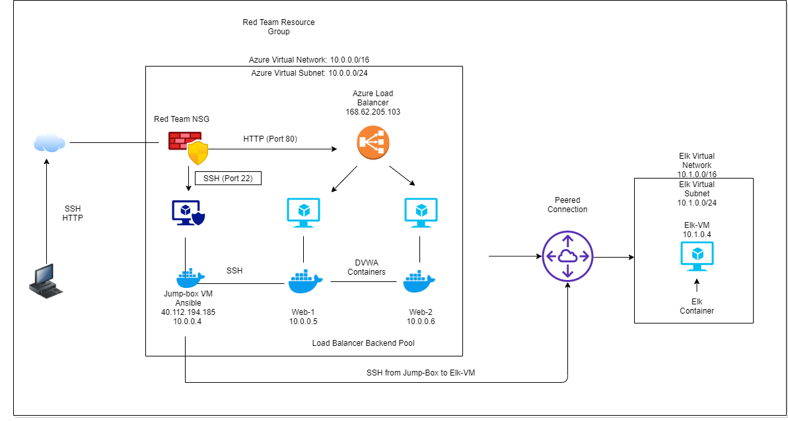

## Automated ELK Stack Deployment

The files in this repository were used to configure the network depicted below.

These files have been tested and used to generate a live ELK deployment on Azure. They can be used to either recreate the entire deployment pictured above. Alternatively, select portions of the Anisble file may be used to install only certain pieces of it, such as Filebeat.

  - playbook1.yml, dvwa.yml, filebeat-config.yml, filebeat-playbook.yml

This document contains the following details:
- Description of the Topology
- Access Policies
- ELK Configuration
  - Beats in Use
  - Machines Being Monitored
- How to Use the Ansible Build

### Description of the Topology

The main purpose of this network is to expose a load-balanced and monitored instance of DVWA, the D*mn Vulnerable Web Application.

Load balancing ensures that the application will be highly available, in addition to restricting traffic to the network.
- The aspect of security that load balancers protect would be availability. A jump box prevents VMs from being exposed to the public Internet.

Integrating an ELK server allows users to easily monitor the vulnerable VMs for changes to the logs and system traffic.
- Filebeat watches for log files.
- Metricbeat records metrics and statistics from the operating system and from services that are running on the server.

The configuration details of each machine may be found below.
_Note: Use the [Markdown Table Generator](http://www.tablesgenerator.com/markdown_tables) to add/remove values from the table_.
   
| Name     | Function | IP Address | Operating System |
|----------|----------|------------|------------------|
| Jump Box | Gateway  | 10.0.0.1   | Linux            |
| Web-1    | VM       | 10.0.0.5   | Linux            |
| Web-2    | VM       | 10.0.0.6   | Linux            |
| Elk-VM   | Elk      | 10.1.0.4   | Linux            |

### Access Policies

The machines on the internal network are not exposed to the public Internet. 

Only the Jump Box machine can accept connections from the Internet. Access to this machine is only allowed from the following IP addresses:
- 10.0.0.1 & 10.0.0.2

Machines within the network can only be accessed by SSH.
- The Jump Box VM is allowed access to the ELK VM. The IP address of the Jump Box is 10.0.0.1._

A summary of the access policies in place can be found in the table below.

| Name     | Publicly Accessible | Allowed IP Addresses |
|----------|---------------------|----------------------|
| Jump Box | Yes w/a pub. key    | 10.0.0.1 10.0.0.2    |
| Web-1    | No                  |                      |
| Web-2    | No                  |                      |

### Elk Configuration

Ansible was used to automate configuration of the ELK machine. No configuration was performed manually, which is advantageous because...
- It allows IT administrators to spend their time and energy on more important tasks.

The playbook implements the following tasks:
- Installs Docker
- Installs Python 3
- Installs the Docker python module
- Installs DVWA
- Installs Docker services on startup

The following screenshot displays the result of running `docker ps` after successfully configuring the ELK instance.

### Target Machines & Beats
This ELK server is configured to monitor the following machines:
- Web-1 10.0.0.5
- Web-2 10.0.0.6

We have installed the following Beats on these machines:
- Filebeat

These Beats allow us to collect the following information from each machine:
- Filebeat monitors log files, collects log events, and forwards this info to Elasticsearch or Logstash for indexing. An example would be logs from security devices. 
- Metricbeat collects metrics from your system. An example would be the metrics for CPU and memory.
- Packetbeat monitors network traffic such as the traffic from your hosts and containers.
- Winlogbeat monitors Windows logs like login successes and failures.
- Auditbeat collects the Linux audit framework data and monitors the integrity of the files.
- Heartbeat monitors services for their availability. Once given a list of URLs, Heartbeat verifies if they are active.
- Functionbeat is a serverless shipper for cloud data. An example would be AWS Lambda.

